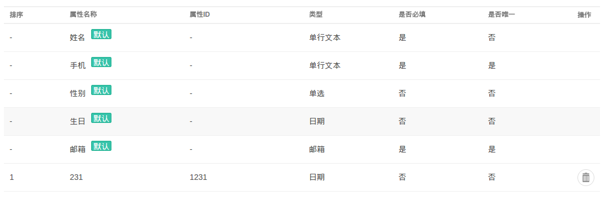
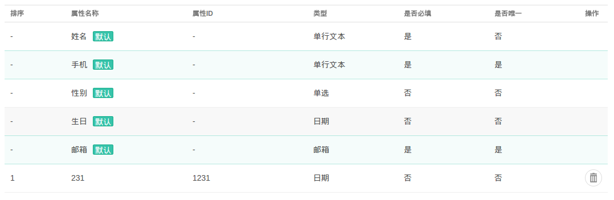
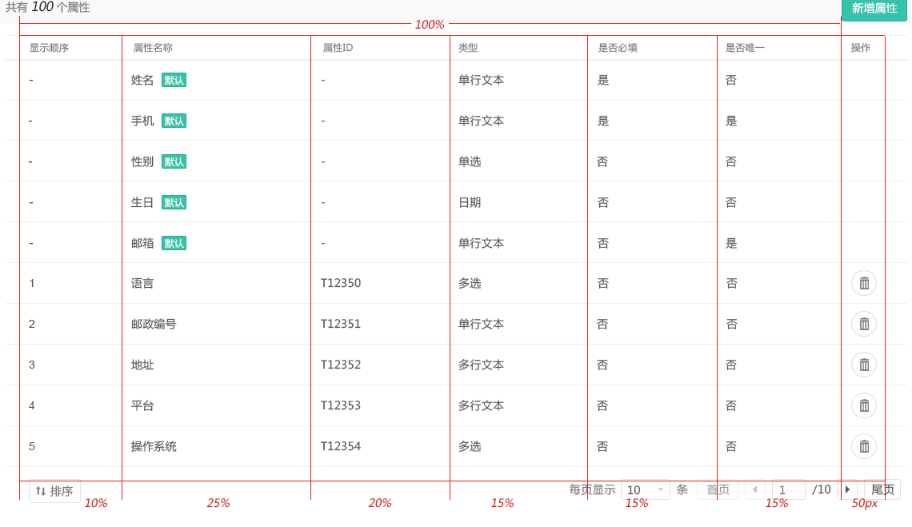

## Table Theme
The document [Quncrm Design Doc](http://git.augmentum.com.cn/scrm/aug-marketing/wikis/quncrm-design-doc) have defined a new table style for our system. For convenience, a theme is used to format the table.

The class `os-table` and `os-recent-data` is reserved in quncrm for the component "Table Theme", so please do not override those two classes, otherwise the style in other pages may be ruined.

### How to use
Use this component by add a class named `os-table` into the `class` of <table> or other html elements which wraps the <table>, like <div> or <section>.

```html
  <table class="os-table">
    <!-- content of table -->
  </table>
```

The table may looks like:  


You can also add `os-table` to the element which wraps table.

```html
  <div class="os-table">
    <table>
      <!-- content of table -->
    </table>
  </div>
```

And it will get the same result.

As defined in [Quncrm Design Doc](http://git.augmentum.com.cn/scrm/aug-marketing/wikis/quncrm-design-doc), the data in table who was added within 8 hours needs a row style. You can do that by add `.os-recent-data` class into <tr> of <tbody>, like:

```html
  <table class="os-table">
    <thead>
      <!-- table head -->
    </head>
    <tbody>
      <!-- some table rows -->
      <tr class="os-recent-data"><!-- row content --></tr>
      <!-- some other table rows -->
    </tbody>
  </table>
```

This may looks like:  


### Custome Column Width
You may get the spec like:  


This can be easily done by:

```html
  <style>
    .custom-colume thead th:nth-child(1),
    .custom-colume tbody td:nth-child(1) {
      width: 10%
    }

    .custom-colume thead th:nth-child(2),
    .custom-colume tbody td:nth-child(2) {
      width: 25%;
    }

    .custom-colume thead th:nth-child(3),
    .custom-colume tbody td:nth-child(3) {
      width: 20%;
    }

    .custom-colume thead th:nth-child(4),
    .custom-colume tbody td:nth-child(4) {
      width: 15%;
    }

    .custom-colume thead th:nth-child(5),
    .custom-colume tbody td:nth-child(5) {
      width: 15%;
    }

    .custom-colume thead th:nth-child(6),
    .custom-colume tbody td:nth-child(6) {
      width: 15%;
    }

    .custom-colume thead th:nth-child(7),
    .custom-colume tbody td:nth-child(7) {
      width: 50px;
    }
  </style>

  <div class="os-table">
    <table class="custom-columns">
      <!-- content of table -->
    </table>
  </div>
```
