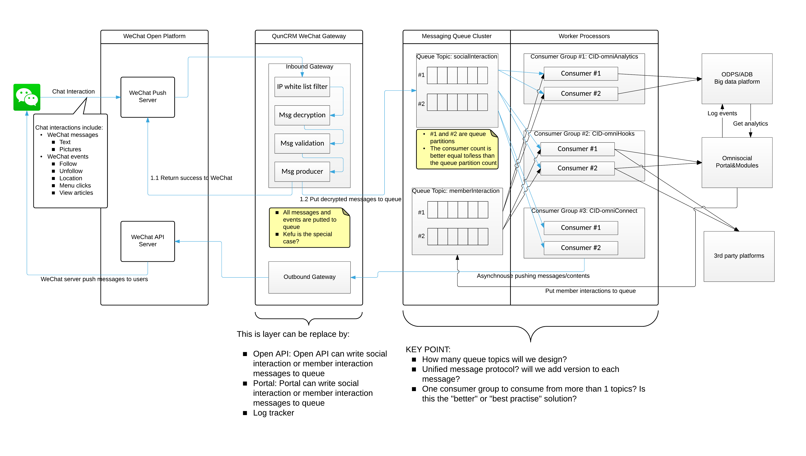
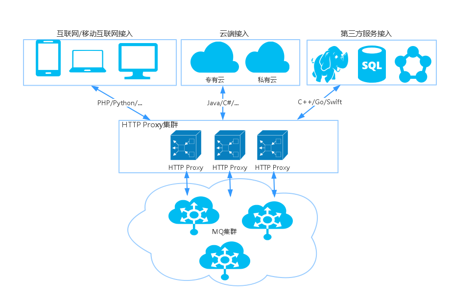
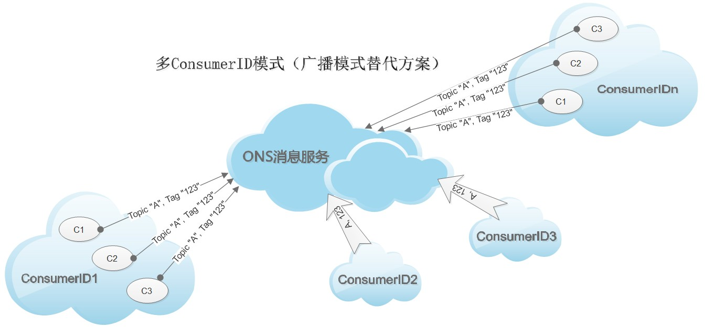

统一的消息中间件，开发和测试环境基于[阿里云开源的RocketMQ](https://github.com/alibaba/RocketMQ) 构建，staging和生产环境基于[阿里云消息队列](https://help.aliyun.com/product/8315024_29530.html)构建.

群脉消息中间件主要解决两个问题：

- 对微信等Social平台消息和事件的处理流程解偶。针对微信的推送消息或者事件，通常需要串行的进行多种业务逻辑的处理：保存微信的推送消息 -> 针对推送消息做业务处理（推送欢迎消息、发送优惠等） -> 数据统计 -> Webhook 通知第三方的开发者。通过集成统一的消息中间件，将串行的处理流程并行化。
- 对群脉平台系统内部的消息处理统一化、异步化，包括封装统一的消息模型、统一的编程模型，对群脉平台以及模块开发者提供统一的消息和队列服务。

High level conceptive design:



这份文档会涵盖：topic的设计，消息生产者的设计，消息消费者的设计，消息的设计等；同时也会包含关键class的定义和主要流程的流程图。

# 消息队列Topic的设计

在消息系统中，`Topic`充当了queue的角色，`Producer`发往不同的`Topic`的消息，会进入不同的queue。`Consumer`可以关联`Topic`去消费不同`Topic`下的队列消息。

目前系统中会设计三类`Topic`：

- 第一类，`social interactions`：针对不同的环境和不同的渠道，创建单独的`Topic`，包括：`social_default_WECHAT` 接收和处理来自群脉SaaS环境的微信互动消息；PID为`PID_social_msg`的Producer会向这个topic下写入消息
- 第二类，`member interactions`：`Topic` 为 `member_interactions`, 接收来自群脉系统和会员行为相关的互动消息和事件；PID为`PID_member_msg`的Producer会向这个topic下写入消息
- 第三类，`module interactions`：`Topic` 为 `module_events`。考虑到模块开发者的异步消息机制，提供统一的处理机制；PID为`PID_module_msg`的Producer会向这个topic下写入消息

# 消息队列中消息的设计

## 统一的消息格式

所有的消息包含以下字段：

- msgId: Topic的消息的唯一ID；有消息队列系统在`publish`消息产生；类型为string
- bornTime：消息进入队列的时间；`Producer` `publish`消息时进入Topic队列的时间；由消息队列系统产生；类型为timestaps string
- body：群脉平台上的业务消息；格式为Json编码的string

例如：

```
{
    "msgId": "0A021F7300002A9F000000000647076D",
    "bornTime": "1418973464204",
    "body":"{\"key\":\"value\"}"
}
```

该数据格式有RocketMQ和阿里云Ons定义，body里的数据格式由我们自己定义。

针对不同的Topic，`body`下的数据格式定义会有不同。

## 针对TCP和HTTP方式处理消息的异同说明

由于RocketMQ和阿里云Ons云平台对消息处理方式的不同，针对HTTP接入和TCP接入时，对消息的编解码的方式会稍有不同。

假定某一个Topic下的body格式如下：{"k":"v"}

TCP方式产生消息例子：

```
Message msg = new Message( //
                // Message Topic
                "socialInteraction",
                // Message Tag,
                // 可理解为Gmail中的标签，对消息进行再归类，方便Consumer指定过滤条件在ONS服务器过滤
                "event",
                // Message Body
                // 任何二进制形式的数据， ONS不做任何干预，
                // 需要Producer与Consumer协商好一致的序列化和反序列化方式
                "{\"k\":\"v\"}".getBytes()); //**统一消息格式定义中的body里的json string，encode成bytes**
```

HTTP方式产生消息例子：

```
Request req=httpClient.POST(url+"message/?topic="+socialInteraction+"&time="+date+"&tag=event");
ContentProvider content = new StringContentProvider({\"k\":\"v\"}); //**统一消息格式定义中的body下的json**
req.content(content);
```

## `social interactions` 类Topic下的消息体body格式定义

该Topic下，body字段定义如下：

```
{
    "channel":"5707623ee4b044b12d40ee57", //social渠道的ID
    "platform": "wechat|weibo|alipay",
    "msgType":"event|msg", //消息类型，事件消息或者普通消息，该字段也会设置于消息的tag上
    "msgId":"1234567890123456", //social msg ID
    "fromUserId":"osOHRswsq0RT1ctnYro3-yLaAEnE",
    "toUserId":"osOHRswsq0RT1ctnYro3-yLaAEnE",
    "createTime":"123456789",
    "data": {
        "subType":"",//随msgType的不同而不同
        "key":"value" //随着subType不同而不同
    }
}
```

`event` msgType 可以对应的 `subType`包括：

- `subscribe`: 可以包括的扩展data字段有 `eventKey`, `ticket`
- `unsubscribe`: 无扩展data字段
- `scan`: 可以包括的扩展data字段有 `eventKey`, `ticket`
- `location`: 可以包括的扩展data字段有 `latitude` `longitude` `precision`
- `click`: 可以包括的扩展data字段有 `eventKey`
- `view`: 可以包括的扩展data字段有 `eventKey`

`msg` msgType 可以对应的 `subType`包括：

- `text`: 可以包括的扩展data字段有 `content`
- `image`: 可以包括的扩展data字段有 `picUrl`, `mediaId`
- `voice`: 可以包括的扩展data字段有 `mediaId`, `format`， `recognition`
- `video`: 可以包括的扩展data字段有 `mediaId`, `thumbMediaId`
- `shortvideo`: 可以包括的扩展data字段有 `mediaId`, `thumbMediaId`
- `location`: 可以包括的扩展data字段有 `location_x`, `location_y`, `scale`, `label`
- `link`: 可以包括的扩展data字段有 `title`, `url`, `description`

注意：`Producer`将该类消息publish到Topic `social interactions`中时，需要给消息设定一个tag，包括`msgType`字段中的值，即 `event` or `msg`。方便 `Consumer` 可以根据`msgType`进行消息过滤（例如某一类Consuer组只关心event类型的消息）。

## `member interactions` Topic下的消息体body格式定义

该Topic下，body字段定义如下：

```
{
    "platform": "maiscrm:{module}",
    "accountId": "",
    "msgType":"EVENT", //消息类型，目前仅支持事件消息，该字段也会设置于消息的tag上
    "msgId":"1234567890123456", //social msg ID
    "createTime":"123456789",
    "subType": "", //随msgType的不同而不同，参见入下
    "data": {
        "key":"value" //随着subType不同而不同
    }
}
```

`event` msgType 可以对应的 `subType`包括：

- `memberCreated`: 可以包括的扩展data字段有 `channelId`, `channelName`, `social`, `memberId`, `accountId`, `phone`, `isActivated`
- `memberPointChanged`: 可以包括的扩展data字段有 `memberId`, `accountId`, `rewardedPoint`, `reason`, `description`
- `memberLevelUpgraded`: 可以包括的扩展data字段有 `memberId`, `accountId`, `originalLevel`, `newLevel`
- `couponRedeemed`: 可以包括的扩展data字段有 `memberId`, `accountId`, `couponId`, `redeemedStatus`, `redeemedNotes`, `staffId`, `storeId`
- `couponUsed`: 可以包括的扩展data字段有 `memberId`, `accountId`, `couponId`, `channelId`, `channelType`, `status`, `notes`
- `couponIssued`: 可以包括的扩展data字段有 `memberId`, `accountId`, `couponType`, `couponId`
- `staffCreated`: Do we really need this event??
- `moduleInstalled`: 模块安装/激活的事件通知，可以包括的扩展data字段有 `moduleId`, `accountId`

## `module interactions` Topic下的消息体body格式定义

该Topic下，body字段定义如下：

```
{
    "social": "maiscrm:{module}", //{module} cannot be: core
    "msgType":"event", //消息类型，事件消息或者普通消息，该字段也会设置于消息的tag上
    "msgId":"1234567890123456", //social msg ID
    "createTime":"123456789",
    "data": {
        "subType":"",//随msgType的不同而不同
        "key":"value" //随着subType不同而不同
    }
}
```

`event` msgType 可以对应的 `subType`包括：

- `promotionCodeRedeemed`: 可以包括的扩展data字段有 XXX
- `productRedeemed`: 可以包括的扩展data字段有 XXX

# Topic消息 `Producer` 和 `Consumer` 设计

## 概述

群脉系统中消息的 `Producer` 一方，消息的产生是 `on-daemond`，天然的集成在业务场景中，例如 用户关注的时刻，产生一条`subscribe`消息，`Producer`将该消息`publish`到`Topic`中。所以，不需要为了消息的吞吐量而设计专门的多线程多进程系统去`publish`消息，它天然是多进程和多线程的（怎么理解？例如，微信推送消息给 Tomcat，Tomcat中的一个线程池会处理这条消息，在这个线程池的某一个线程中，Producer将这个消息publish到Topic中，publish的动作并行在线程池中）。

但是，Java中基于TCP和 RocketMQ 或者 阿里云Ons 集成，Producer需要和TCP Server建立连接并需要保持这条连接，频繁的`connect`和`close` socket也势必会降低消息publish的性能和吞吐量，在HTTP Server的环境下，进而堵塞HTTP的进程或者线程。因此，需要在Tomcat启动的时候，初始化Producer，并保持Producer的存活，任何其他线程例如thread pool中的thread需要publish消息到Topic中，都需要delegate到这个唯一存活的Producer上去。

消息系统中的 `Consumer` 一方，需要考虑每一个Consumer group下，可以多线程的处理队列中的消息。Java 中，可以配置`PropertyKeyConst.ConsumeThreadNums`类控制Consumer并发消费消息的线程数。

## Java版 Producer实现

群脉目前采用的方案。基于 Spring Bean 的单例，随着Spring的生命周期进行 producer 的 start 和 stop。

用 `Spring MVC` 的 `component` 注解来托管 `Producer` 的生命周期：

```
@Component
public class SocialInteractionProducer extends MessageProducer {

    @PostConstruct
    protected void init() {
        Properties properties = new Properties();
        properties.put(PropertyKeyConst.ProducerId, getProducerId());
        properties.put(PropertyKeyConst.AccessKey, accessKey);
        properties.put(PropertyKeyConst.SecretKey, secretKey);
        producer = ONSFactory.createProducer(properties);
        producer.start();
    }

    @PreDestroy
    protected void destroy() {
        if (producer != null) {
            producer.shutdown();
        }
    }
    
}
```

## PHP版 Producer 实现

PHP 中通过[HTTP的方式接入](https://help.aliyun.com/document_detail/29572.html?spm=5176.7713052740.6.132.lO14MS)，通过RESTful API进行消息的publish。



群脉的portal以及模块，需要集成PHP版本的SDK以HTTP的方式发布消息到Topic中。

### 环境说明

- 公网测试环境，用于群脉的 DEV 和 Staging，API域名：publictest-rest.ons.aliyun.com
- 生产环境，API域名 hangzhou-rest-internal.ons.aliyun.com

### 消息发布的实现

#### 群脉Core以及混合部署的模块

利用群脉标准产品团队封装好的`service`方法：

```
$memberCreatedMessage = new MemberCreatedMessage(...);
$service->publish($moduleName, $memberCreatedMessage);
```

#### 利用开放API

TODO

### 模块消息订阅的实现

模块开发者，可以注册监听Webhook消息的地址，调用群脉的`service`方法或者Open API实现消息的订阅：

```
$service->listenHookMessages($hookUrl, [$msg, $event]); //在$hookUrl上通过HTTP的方式监听 $msg 和 $event 消息
```

模块开发者，可以在模块被用户安装的时候，向群脉系统里注册希望监听的消息：

```
function onModuleInstalled($account) {
    $service->listenHookMessages($hookUrl, [$msg, $event]);
}

function onModuleUninstalled($account) {
    $service->unlistenHookMessages($hookUrl);
}
```

同时，模块在被安装之后，可以监听其他群脉平台上的模块安装和卸载的事件通知，用于注册监听其他模块发布的消息：

```
//在自己的模块被安装时，向群脉系统注册其他模块安装和卸载的消息
function onModuleInstalled($account) {
    $service->listenHookMessages("mymodule/controller/action", ["moduleInstalled"]); //当发生 moduleInstalled的消息时，通知到mymodule/controller/action
}

//在 mymodule/Controller.php 里的 action方法里监听模块事件
function actionAction() {
    $msg = ... //从POST里面获取发送的消息
    if ($msg->social == "maiscrm:coupon") {
        //当有一个 优惠券 模块被安装是
        $service->listenHookMessages("mymodule/controller/action", ["couponRedeemed"]); 
    }
}
```

和群脉混合部署的模块，可以实现一个继承于 `Webhook`的类，`Webhook` 基类完成了消息的验证：

```
use backend\modules\base\Webhook;

class MyWebHook extends Webhook { //Webhook基类完成消息的验证
    function onReceiveX($message) { //X 为事件的名字，例如 couponRedeemed, 则方法名为 onReceiveCouponRedeemed
        ...
    }
}
```

### 开放API的支持

## Consumer 多进程、多线程的实现

系统中对Consumer的实现，限制在Java和Go两种编程语言中。不管用Java还是Go实现Consumer的客户端，都需要考虑对Consumer的多进程、多线程的方式独立部署。【TODO->】群脉的模块开发者，也可以订阅消息，我们会利用模块级别的Webhook将消息推送到模块的controller-action中来进行处理。

### Java中的 Consumer实现

```
java -jar omniHooks.jar -cid CID-omniHooks -topic socialInteraction -threadNum 20
```

启动一个 Java 进程，该进程的CID为 CID-omniHooks，将从 socialInteraction 消费消息，启动后的线程数为20个。多进程、多线程中的Consumer为[集群模式](https://help.aliyun.com/knowledge_detail/5974214.html?spm=5176.789006189.2.3.shYYSO)来消费队列中的消息。

不同的进程，可以指定不同的CID，多个CID之间是广播模式消费Topic下的消息：

```
java -jar omniAnalytics.jar -cid CID-omniAnalytics -topic socialInteraction -threadNum 20
```

omniHooks.jar 进程和 omniAnalytics.jar 进程之间以[广播模式](https://help.aliyun.com/knowledge_detail/6563990.html?spm=5176.789006189.2.8.ySueoM)消费Topic下的消息，但是进程内的thread以[集群模式](https://help.aliyun.com/knowledge_detail/5974214.html?spm=5176.789006189.2.3.shYYSO)消费队列中的消息:



通过supervisor可以控制启动多个进程来提高消息消费的吞吐量。

### Go中的Consumer实现

目前不做实施。

## 需要实现的Consumer

### Social Consumer

### Webhook Consumer

### Analytics Consumer


